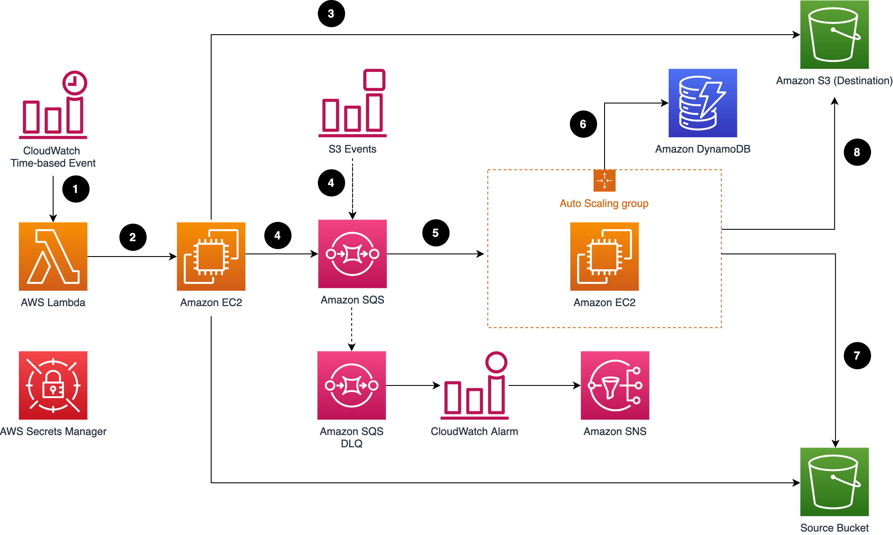

[English](./README.md)

# AWS Data Replication Hub - S3插件

_本项目（AWS Date Replication Hub - S3 Plugin）是基于[huangzbaws@](https://github.com/huangzbaws) 的
[amazon-s3-resumable-upload](https://github.com/aws-samples/amazon-s3-resumable-upload) 基础上开发的。_

[AWS Data Replication Hub](https://github.com/awslabs/aws-data-replication-hub)是一个用于从不同的源复制数据到AWS的解决方案。本项目是该方案的其中一款插件（S3插件）。各插件是可以独立部署和运行的。

以下是本插件计划提供的功能列表：

- [x] 用于Amazon S3国内和海外的相互复制
- [x] 用于从阿里云OSS复制到Amazon S3
- [x] 用于从腾讯云COS复制到Amazon S3
- [x] 用于从七牛云Kodo复制到Amazon S3
- [ ] 用于从华为云OBS复制到Amazon S3
- [x] 用于从Google Cloud Storage复制到Amazon S3(海外)
- [x] 支持元数据信息的复制
- [x] 支持单次全量复制
- [x] 支持增量复制
- [x] 支持增量复制
- [x] 支持基于S3 事件触发复制

## 架构图



在AWS Fargate中运行的ECS任务会列出源存储桶和目标存储桶中的所有对象，并确定应使用哪些对象复制后，将在SQS中为每个要复制的对象创建一条消息。 *CloudWatch定时规则*将触发ECS任务每小时运行一次。

*JobWorker* Lambda函数从SQS中读取消息并根据消息将对象从源存储桶传输到目标桶。

如果某个对象或对象的一部分传输失败，则lambda将尝试几次。 如果之后仍然失败，该消息将被放入“SQS Dead-Letter-Queue”中。 并将触发CloudWatch警报，随后将通过SNS发送电子邮件通知。 请注意，下一次运行中的ECS任务将识别出这些失败的对象或部分，并且重新开始复制过程。

该插件支持传输大文件。它将大文件分成多个小的部分并利用Amazon S3的[multipart upload](https://docs.aws.amazon.com/AmazonS3/latest/dev/mpuoverview.html) 功能进行分段传输。


## 部署

有关此插件的部署的注意事项：:

- 部署本插件会自动在您的AWS账号里创建包括Lambda, DyanomoDB表，ECS任务等
- 部署预计用时3-5分钟
- 一旦部署完成，复制任务就会马上开始

###  部署前准备

- 配置 **凭据**

您需要提供“AccessKeyID”和“SecretAccessKey”（即“AK/SK”）凭据，才能从其他分区S3或其他云存储服务中读取或写入存储桶。 凭据会以安全方式存储于参数存储区。

请在**AWS Systems Manager** 的**参数存储区**创建一个参数，选择 **SecureString** 作为其类型，然后按照以下格式提供相应的**值**。

```
{
  "access_key_id": "<Your Access Key ID>",
  "secret_access_key": "<Your Access Key Secret>"
}
```

- 配置 **ECS集群** and **VPC**

此插件的部署将在您的AWS账户中启动和运行ECS Fargate任务，因此，如果您还没有配置ECS集群和VPC，则需要在部署插件之前对其进行设置。

> 注意：对于ECS群集，您可以选择**仅限网络**类型。 对于VPC，请确保VPC至少具有两个子网分布在两个可用区域上。


### 可用参数

以下是部署时可用的参数列表:

| 参数                       | 默认值            | 说明                                                                                                               |
|---------------------------|------------------|---------------------------------------------------------------------------------------------------------------------------|
| sourceType                | Amazon_S3        | 选择源存储类型，包括Amazon_S3，Aliyun_OSS，Qiniu_Kodo， Tencent_COS，Google_GCS。                                 |
| jobType                   | GET              | 如果源存储桶不在当前帐户中，请选择GET。 否则，选择PUT                                              |
| srcBucketName             | 需要指定          | 源存储桶名称                                                                                                       |
| srcBucketPrefix           | ''               | 源存储桶对象前缀。 插件只会复制具有特定前缀的对象.                                        |
| destBucketName            | 需要指定          | 目标存储桶名称                                                                                                  |
| destBucketPrefix          | ''               | 目标存储桶前缀。插件将上传到指定的前缀                                                      |
| destStorageClass          | STANDARD         | 目标存储类型，可选的值有: 'STANDARD', 'STANDARD_IA', 'ONEZONE_IA', 'INTELLIGENT_TIERING'        |
| ecsClusterName            | 需要指定          | 用于运行ECS任务的ECS集群名称                                                                                          |
| ecsVpcId                  | 需要指定          | 用于运行ECS任务的VPC ID，例如 vpc-bef13dc7                                                                                  |
| ecsSubnets                | 需要指定          | 用于运行ECS任务的子网ID。 请提供至少两个以逗号分隔的子网，例如 子网97bfc4cd，子网7ad7de32   |
| credentialsParameterStore | ''               | 用于将凭据保存在参数存储中的参数名称， 如果是源是公开的存储桶，可以放空。                                                           |
| regionName                | ''               | region名称，例如cn-west-1，如果源是Google Cloud Storage, 可以放空。                                                           |
| alarmEmail                | 需要指定           | 警报电子邮件。 错误将发送到此电子邮件                                                                          |
| enableS3Event             | No               | 是否支持S3事件自动触发复制， 此功能仅在源存储桶是当前账号的情况下有效，默认不启用。<br> 可选的值有: 'No', 'Create_Only', 'Delete_Only', 'Create_And_Delete'。<br> 注意： 目前还不支持Delete Marker的事件。                       |
| lambdaMemory              | 256              | Lambda内存， 默认为 256 MB                                                                                      |
| multipartThreshold        | 10               | 分段上传的阀值（单位： MB）默认为10 MB                                                             |
| chunkSize                 | 5                | 分片大小，默认为5 MB                                                                  |
| maxThreads                | 10               | Lambda分段上传的线程数                                                              |


### 用AWS Cloudformation方式部署

请按照以下步骤通过AWS Cloudformation部署此插件。

1.登录到AWS管理控制台，切换到将CloudFormation Stack部署到的区域。

1.单击以下按钮在该区域中启动CloudFormation堆栈。

  - 部署到AWS海外区

  [](https://console.aws.amazon.com/cloudformation/home#/stacks/create/template?stackName=DataReplicationS3Stack&templateURL=https://aws-gcr-solutions.s3.amazonaws.com/Aws-data-replication-component-s3/latest/Aws-data-replication-component-s3.template)

  - 部署到AWS中国区

  [](https://console.amazonaws.cn/cloudformation/home#/stacks/create/template?stackName=DataReplicationS3Stack&templateURL=https://aws-gcr-solutions.s3.cn-north-1.amazonaws.com.cn/Aws-data-replication-component-s3/latest/Aws-data-replication-component-s3.template)
    
1.单击**下一步**。 相应地为参数指定值。 如果需要，请更改堆栈名称。

1.单击**下一步**。 配置其他堆栈选项，例如标签（可选）。

1.单击**下一步**。 查看并勾选确认，然后单击“创建堆栈”开始部署。

如果要更改解决方案，可以参考[定制](CUSTOM_BUILD.md) 指南.

> 注意：如果不再需要复制任务，则可以从CloudFormation控制台中删除堆栈。

### 用AWS CDK方式进行部署

如果要使用AWS CDK部署此插件，请确保满足以下先决条件：

* [AWS Command Line Interface](https://aws.amazon.com/cli/)
* Node.js 12.x 或以上版本
* Docker

在项目**source**文件夹下，运行以下命令将TypeScript编译为JavaScript。

```
cd source
npm install -g aws-cdk
npm install && npm run build
```

然后使用“cdk deploy”命令来部署。请相应地指定参数值，例如：

```
cdk deploy --parameters srcBucketName=<source-bucket-name> \
--parameters destBucketName=<dest-bucket-name> \
--parameters alarmEmail=xxxxx@example.com \
--parameters jobType=GET \
--parameters sourceType=Amazon_S3 \
--parameters credentialsParameterStore=drh-credentials \
--parameters regionName=cn-north-1 \
--parameters ecsClusterName=test \
--parameters ecsVpcId=vpc-bef13dc7 \
--parameters ecsSubnets=subnet-97bfc4cd,subnet-7ad7de32
```

> 注意：如果不再需要复制任务，则可以简单地运行“cdk destroy”。 此命令将从您的AWS账户中删除本插件所创建的堆栈。
