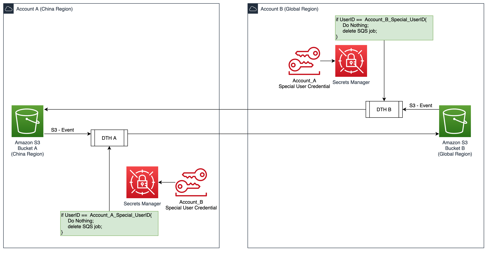
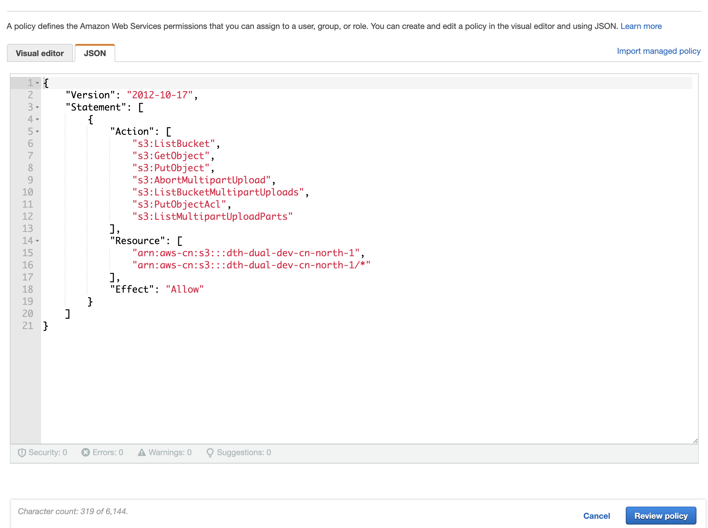
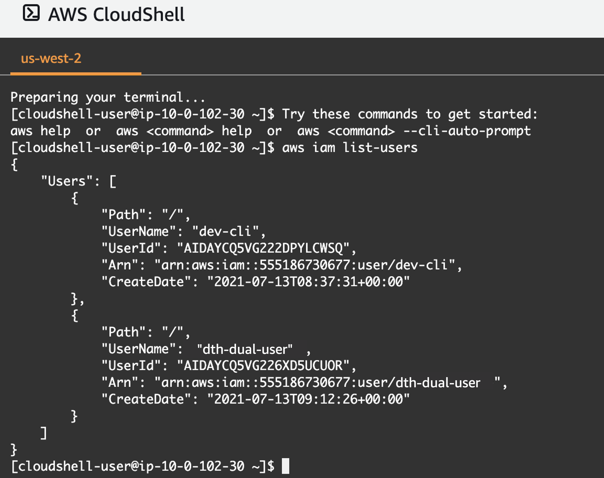
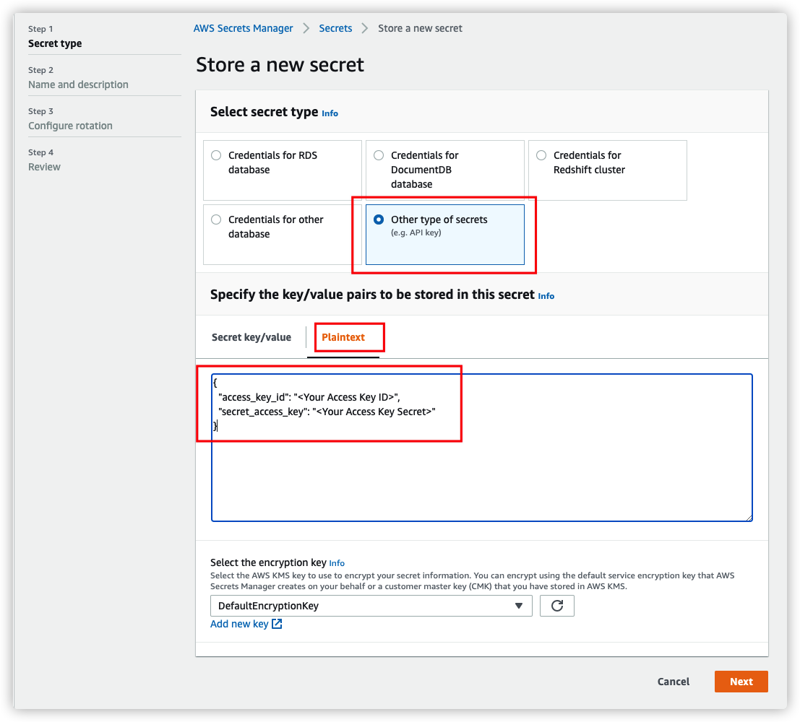
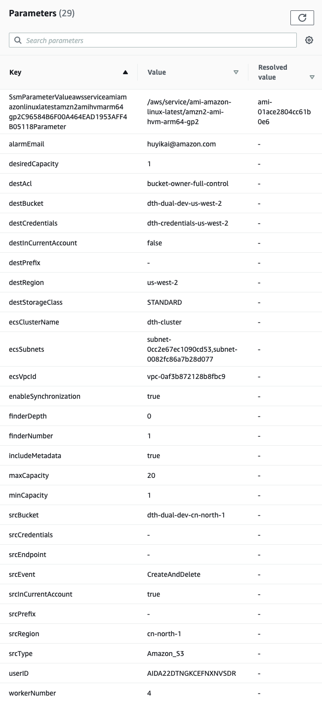
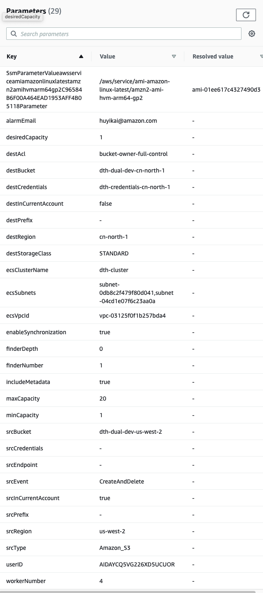
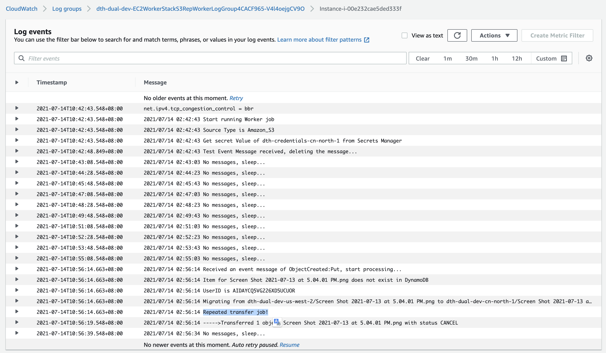

[English](./DUAL_WAY_DEPLOYMENT_EN.md)

# 配置双向同步

此版本支持在两个账户的S3桶之间实现双向同步，本教程将带领您完成部署。

要在两个账户的S3桶之间实现双向同步，需要分别在两个账户中各部署一次该Solution，其系统架构图如下图所示。其中 Account A 位于 China Region，Account B 位于 Global Region。本教程将引导您分别在 Account A 内以及 Account B 内完成 Data Transfer Hub S3 plugin 的部署。



本方案的**主要工作**是，通过两个账户内专用的IAM user的UserID，**识别**出由于重复触发导致的额外传输，并**终止**由于循环触发导致的数据传输。

本方案虽然目标为实现 China Region 和 Global Region 中 S3桶的同步，但是您也可以用相同的方法实现任意两个S3 桶的双向同步。

## 部署步骤
* [PreRequest](#PreRequest)
    * Step1 在 Account A 内创建专用 IAM user
    * Step2 获取 Account A 专用 User 的 userID
    * Step3 在 Account B 内创建专用 IAM user
    * Step4 获取 Account B 专用 User 的 userID
* [ConfigCredential](#ConfigCredential)
    * Step5 配置 Account A 的 Secrets Manager
    * Step6 配置 Account B 的 Secrets Manager
* [Deployment](#Deployment)
    * Step7 在 Account A 内部署 Data Transfer Hub S3 Plugin
    * Step8 在 Account B 内部署 Data Transfer Hub S3 Plugin
* [FAQ](#faq)
  * [如何确认双向同步已部署](#如何确认双向同步已部署)
  * [如何监控](#如何监控)
  * [如何调试](#如何调试)
  * [在CloudWatch里没有日志](#在CloudWatch里没有日志)
  * [如何客制化](#如何客制化)

> 注意: 在本教程中，我们假设 Account A 选择 China Region 的 cn-north-1，Account B 选择 Global Region 的 us-west-2.

# PreRequest

## Step1 Account A: 创建专用 IAM user

### 1) 创建Policy

登陆Account A的 IAM 控制台，此处我们登陆[cn-north-1的控制台](https://console.amazonaws.cn/iamv2/home#/policies)。

点击 **Create Policy**，随后点击**JSON**，输入下述的Json，**请把 dth-dual-dev-cn-north-1 换成您 Account A 中的 S3 桶名称**：



```json
{
    "Version": "2012-10-17",
    "Statement": [
        {
            "Action": [
                "s3:ListBucket",
                "s3:GetObject",
                "s3:PutObject",
                "s3:AbortMultipartUpload",
                "s3:ListBucketMultipartUploads",
                "s3:PutObjectAcl",
                "s3:ListMultipartUploadParts"
            ],
            "Resource": [
                "arn:aws-cn:s3:::dth-dual-dev-cn-north-1",
                "arn:aws-cn:s3:::dth-dual-dev-cn-north-1/*"
            ],
            "Effect": "Allow"
        }
    ]
}
```

随后点击 **Next: Tags**, **Next: Review**, 随后输入Policy的名称，例如此处输入`dth-dual-policy`, 并点击 **Create Policy**.

### 2) 创建User
在完成Policy的创建后，我们要创建一个User，并把上一步创建的Policy赋予该User。

登陆Account A的IAM 控制台的User界面，此处我们登陆[cn-north-1的控制台](https://console.amazonaws.cn/iamv2/home#/users)。

点击 **Add Users**, 随后在 **User name** 输入User名称，您可以任意起名，此处令其为`dth-dual-user`，并勾选 **Programmatic access**

随后点击 **Nest: Permissions**, 选择 **Attach existing policies directly** 中选择上一步中创建好的Policy，如`dth-dual-policy`:


随后点击 **Next: Tags**, **Next: Review**, 并点击 **Create User**.

**注意:**  请记录下您的`AccessKeyID`和`SecretAccessKey`（即`AK/SK`）, 您将在 **Step6** 配置 Account B 的 Secrets Manager 中使用到, 其将赋予Account B 访问 Account A 中 S3 数据桶的权限。

## Step2 Account A: 获取专用 User 的 userID

如架构图中所述，本方案将通过UserID来识别出由于重复触发导致的额外传输，并终止由于循环触发导致的数据传输。

请在您的本地环境中安装并配置好 **AWS CLI**，请参考[教程](https://docs.aws.amazon.com/zh_cn/cli/latest/userguide/install-cliv2.html)。（或者您可以在本账户中启动一台EC2，并赋予其管理员权限。）

随后在 Terminal 中输入：

```shell
aws iam list-users
```


记录下您在 **Step1** 中创建的User的 **UserId**， 如图中的`AIDA22DTNGKCEFNXNVSDR`, 您将在 **Step7** 中用到该UserID。


## Step3 Account B: 创建专用 IAM user

同样的，我们将在Account B 同样创建 Policy 和对应的 User。

### 1) 创建Policy

登陆Account B 的 IAM 控制台，此处我们登陆[Global的控制台](https://console.aws.amazon.com/iamv2/home?#/policies)。

点击 **Create Policy**，随后点击**JSON**，输入下述的Json，**请把 dth-dual-dev-us-west-2 换成您 Account B 中的 S3 桶名称**：

```json
{
    "Version": "2012-10-17",
    "Statement": [
        {
            "Action": [
                "s3:ListBucket",
                "s3:GetObject",
                "s3:PutObject",
                "s3:AbortMultipartUpload",
                "s3:ListBucketMultipartUploads",
                "s3:PutObjectAcl",
                "s3:ListMultipartUploadParts"
            ],
            "Resource": [
                "arn:aws:s3:::dth-dual-dev-us-west-2",
                "arn:aws:s3:::dth-dual-dev-us-west-2/*"
            ],
            "Effect": "Allow"
        }
    ]
}
```

随后点击 **Next: Tags**, **Next: Review**, 随后输入Policy的名称，例如此处输入`dth-dual-policy`, 并点击 **Create Policy**.

### 2) 创建User
同样的，在完成Policy的创建后，我们要创建一个User，并把上一步创建的Policy赋予该User。

登陆Account B的IAM 控制台的User界面，此处我们登陆[Global的控制台](https://console.aws.amazon.com/iamv2/home#/users)。

点击 **Add Users**, 随后在 **User name** 输入User名称，您可以任意起名，此处令其为`dth-dual-user`，并勾选 **Programmatic access**

随后点击 **Nest: Permissions**, 选择 **Attach existing policies directly** 中选择上一步中创建好的Policy，如`dth-dual-policy`:


随后点击 **Next: Tags**, **Next: Review**, 并点击 **Create User**.

**注意:**  请记录下您的`AccessKeyID`和`SecretAccessKey`（即`AK/SK`）, 您将在 **Step5** 配置 Account A 的 Secrets Manager 中使用到, 其将赋予Account A 访问 Account B 中 S3 数据桶的权限。

## Step4 Account B: 获取专用 User 的 userID

在完成User的创建后，我们需要获得它所对应的 UserID。


> 注意: 在Global区域，您可以直接通过CloudShell获取该UserID.

登陆[CloudShell控制台](https://us-west-2.console.aws.amazon.com/cloudshell/home?region=us-west-2)，随后在 Terminal 中输入：

```shell
aws iam list-users
```



记录下您在 **Step3** 中创建的User的 **UserId**， 如图中的`AIDAYCQ5VG226XD5UCUOR`，您将在 **Step8** 中用到该UserID。

# ConfigCredential

## Step5 Account A: 配置 Secrets Manager

您需要提供`AccessKeyID`和`SecretAccessKey`（即`AK/SK`）才能从另一个 AWS 账户 (即 Account B) 读取或写入 S3中的存储桶，凭证将存储在 AWS Secrets Manager 中。 

打开Account A `cn-north-1` Region 管理控制台的 [Secrets Manager](https://console.amazonaws.cn/secretsmanager/home?region=cn-north-1#!/listSecrets)。 在 Secrets Manager 主页上，单击 **存储新的密钥**。 对于密钥类型，请使用**其他类型的秘密**。 对于键/值对，请将下面的 JSON 文本复制并粘贴到明文部分，并相应地将值更改为您在 **Step3** 中在Account B us-west-2中创建User的 AK/SK。

```
{
  "access_key_id": "<Your Access Key ID>",
  "secret_access_key": "<Your Access Key Secret>"
}
```


然后下一步指定密钥名称，例如此处命名为 `dth-credentials-us-west-2`, 最后一步点击创建。

## Step6 Account B: 配置 Secrets Manager

同样的，在Account B 中创建用于访问 Account A中 S3 数据的 Secretes Manager 中的密钥。

打开Account B `us-west-2` Region 管理控制台的 [Secrets Manager](https://us-west-2.console.aws.amazon.com/secretsmanager/home?region=us-west-2#!/listSecrets)。 在 Secrets Manager 主页上，单击 **Store a new secret**。 对于密钥类型，请使用**Other type of secrets**。 对于键/值对，请将下面的 JSON 文本复制并粘贴到Plaintext部分，并相应地将值更改为您在 **Step1** 中在Account A cn-north-1中创建User的 AK/SK。

```
{
  "access_key_id": "<Your Access Key ID>",
  "secret_access_key": "<Your Access Key Secret>"
}
```



然后下一步指定密钥名称，例如此处命名为 `dth-credentials-cn-north-1`, 最后一步点击创建。


# Deployment

## Step7 Account A: 部署 Data Transfer Hub S3 Plugin
1.单击以下按钮在该区域中启动CloudFormation堆栈。

  - 部署到AWS中国北京或宁夏区

  [](https://console.amazonaws.cn/cloudformation/home#/stacks/create/template?stackName=DTHS3DualStack&templateURL=https://drh-solution.s3.cn-northwest-1.amazonaws.com.cn/dth-s3-sync-plugin/v1.1.2/DataTransferS3Stack-ec2.template)

**注意**: 在Template的参数的 `userID for Two Way Synchronization` ，填写 **Step2** 中您获取的UserID，本案例中为AIDA22DTNGKCEFNXNVSDR。 本测试案例中 China Region的参数如下：



## Step8 Account B: 部署 Data Transfer Hub S3 Plugin
1.单击以下按钮在该区域中启动CloudFormation堆栈。

  - 部署到AWS海外区

  [](https://console.aws.amazon.com/cloudformation/home#/stacks/create/template?stackName=DTHS3DualStack&templateURL=https://drh-solution.s3.us-west-2.amazonaws.com/dth-s3-sync-plugin/v1.1.2/DataTransferS3Stack-ec2.template)

**注意**: 在Template的参数的 `userID for Two Way Synchronization` ，填写 **Step4** 中您获取的UserID，本案例中为AIDAYCQ5VG226XD5UCUOR。 本测试案例中 Global Region的参数如下：



## FAQ

### 如何确认双向同步已部署

**问题**：部署解决方案后，如何确认双向同步已成功部署？

**回答**：部署后，你可以向两侧任意一个S3 存储桶内上传一个文件，如此处向 Account B 的S3中上传文件，随后您可以打开 Account B 的Cloudwatch log group，找到如下格式的日志组，其为EC2 Worker的日志信息：

- &lt;堆栈名&gt;-EC2WorkerStackS3RepWorkerLogGroup&lt;随机后缀&gt;

如果您看到出现`Repeated transfer job!` 的日志信息，则说明双向同步已启动，并且Worker成功识别了重复触发的信息。



### 如何监控

**问题**：部署解决方案后，如何监视进度？

**回答**：部署后，将创建一个cloudwatch仪表板供您监视进度，运行/等待作业，网络，已传输/失败的对象等指标将记录在仪表板中。下图是一个示例：


### 如何调试

**问题**：部署完后似乎没有正常运行，该如何调试？

**回答**：部署堆栈时，将要求您输入堆栈名称（默认为DTHS3Stack），大多数资源将使用该堆栈名称作为前缀进行创建。 例如，SQS Queue名称将采用`<堆栈名>-S3TransferQueue-<随机后缀>`的格式。

此插件将创建两个主要的CloudWatch日志组。

- &lt;堆栈名&gt;-ECSStackFinderLogGroup&lt;随机后缀&gt;

这是定时ECS任务的日志组。如果未传输任何数据，则应首先检查ECS任务运行日志中是否出了问题。 这是第一步。

- &lt;堆栈名&gt;-EC2WorkerStackS3RepWorkerLogGroup&lt;随机后缀&gt;

这是所有EC2实例的日志组，可以在此处找到详细的传输日志。

如果您在日志组中找不到任何有帮组的内容，请在Github中提出问题。

### 在CloudWatch里没有日志

**问题**：我部署完该插件, 但我在在CloudWatch日志组里没有找到任何日志

**回答**：这一定是因为您在部署此解决方案时选择的子网没有公共网络访问权限，因此 Fargate任务无法拉取映像，而EC2实例则无法下载 CloudWatch Agent以将日志发送到 CloudWatch。 请检查您的 VPC 设置（请参阅[部署指南](./DEPLOYMENT_CN.md) 步骤 1）。 修复问题后，您需要手动终止正在运行的此方案的EC2 实例（如果有的话）。之后，Auto Scaling Group将自动启动新实例。


### 如何客制化

**问题**：我想要更改此方案，需要做什么?

**回答**：如果要更改解决方案，可以参考[定制](./CUSTOM_BUILD.md) 指南.
